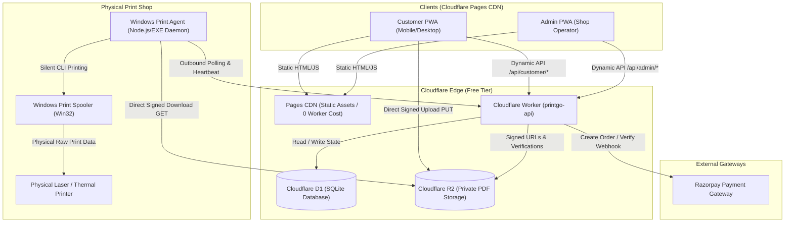
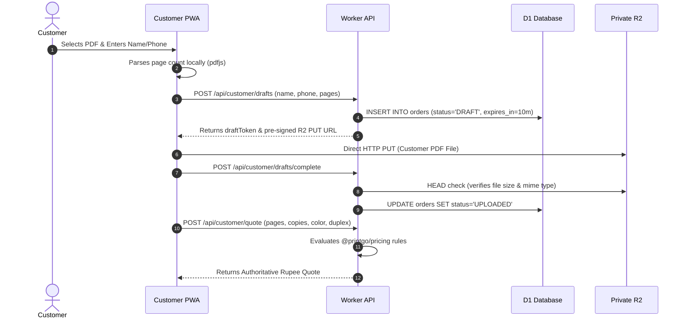
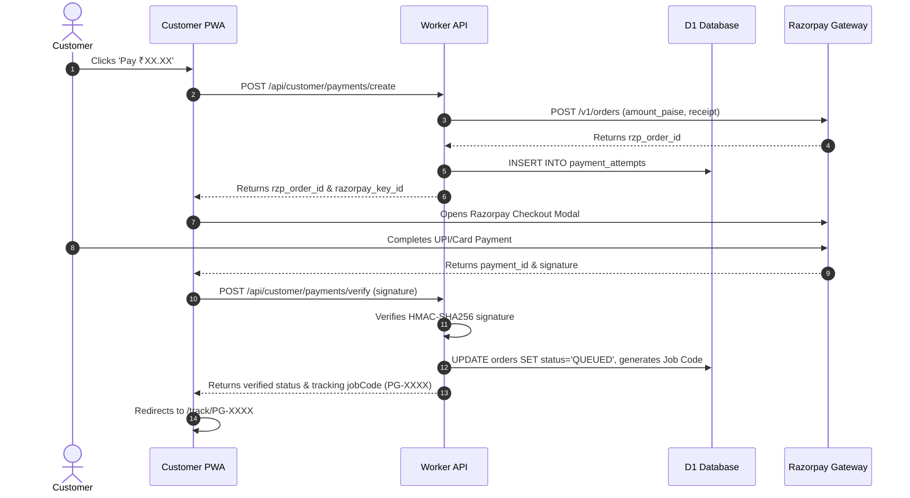
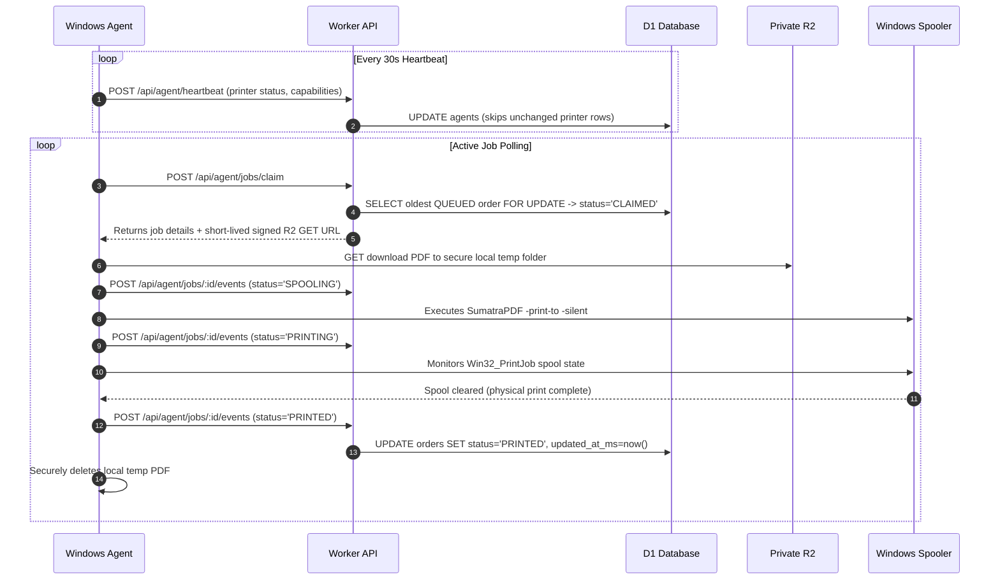

# PrintGo V2 — Comprehensive Codebase Map & Architectural Blueprint

## 1. System Architecture Overview

PrintGo V2 is an online-to-offline print automation platform purpose-built for a single physical print shop. It operates with high reliability on **Cloudflare's 100% Free Tier** combined with an on-premises **Windows Agent** running adjacent to the physical printer hardware.



---

## 2. Monorepo Directory Map & Ownership

```
Printe_Go_/
├── apps/
│   ├── web/customer/              # Customer-facing React PWA
│   │   ├── public/                # Static assets, icons, manifest, _routes.json, _redirects
│   │   ├── src/
│   │   │   ├── api.ts             # Typed HTTP client for /api/customer/*
│   │   │   ├── App.tsx            # Main upload wizard & quote review interface
│   │   │   ├── TrackingPage.tsx   # Live order tracking with backoff polling
│   │   │   └── pdf.ts             # In-browser PDF page counting & validation
│   ├── web/admin/                 # Shop Operator React PWA
│   │   ├── public/                # Static assets, icons, manifest, _routes.json, _redirects
│   │   ├── src/
│   │   │   ├── api.ts             # Typed HTTP client for /api/admin/* (cookie-auth)
│   │   │   ├── App.tsx            # Admin router, login gate, layout navigation
│   │   │   ├── LiveOrdersPage.tsx # Live order queue monitor with visibility-aware poll
│   │   │   ├── PricingPage.tsx    # Print rates and service charges editor
│   │   │   └── PrinterPage.tsx    # Agent pairing & printer hardware monitor
│   ├── api/worker/                # Cloudflare Worker Backend
│   │   ├── src/
│   │   │   ├── router.ts          # Root HTTP dispatcher & CORS handler
│   │   │   ├── customer/          # Customer endpoints & database repository
│   │   │   ├── admin/             # Admin endpoints, auth middleware & repository
│   │   │   ├── agent/             # Agent pairing, heartbeat & claim repository
│   │   │   ├── printing/          # Print job dispatch, lifecycle queries & repository
│   │   │   ├── payments/          # Razorpay order creation, webhooks & verification
│   │   │   └── storage/           # S3-compatible R2 presigning & verification
│   └── agent/windows/             # On-premises Windows Print Service
│       ├── src/
│       │   ├── index.ts           # Agent daemon entrypoint & CLI commands
│       │   ├── agent-daemon.ts    # Polling loop, heartbeat & job claim runner
│       │   ├── agent-client.ts    # HTTPS client talking to Worker /api/agent/*
│       │   ├── storage/           # DPAPI Windows credential encryption store
│       │   └── printing/          # SumatraPDF execution, Win32 CIM & spool monitor
├── packages/
│   ├── domain/                    # State machines, order transitions, pure business logic
│   ├── validation/                # Zod schemas for all API payloads and entities
│   ├── api-contract/              # Shared TypeScript interfaces for HTTP requests/responses
│   ├── pricing/                   # Authoritative quote calculation rules
│   ├── auth/                      # PBKDF2 password hashing & session management
│   └── shared/                    # Common utility functions (formatters, units)
├── database/
│   └── migrations/                # D1 SQL migration files (0001 - 0007)
├── scripts/                       # Local runner, D1 validation, packaging scripts
└── docs/                          # Technical specifications and architecture guides
```

---

## 3. End-to-End Core Workflows

### 3.1 Customer Upload & Quoting



### 3.2 Payment Verification & Order Queuing



### 3.3 Windows Agent Execution & Physical Printing



---

## 4. D1 Database Schema Map

| Table Name                  | Primary Role                           | Key Columns                                                                        |
| :-------------------------- | :------------------------------------- | :--------------------------------------------------------------------------------- |
| `installation`              | Single shop bootstrap metadata         | `id`, `shop_name`, `contact_phone`, `is_installed`                                 |
| `admin_users`               | Operator authentication                | `id`, `username`, `password_hash`, `salt`                                          |
| `admin_sessions`            | Active operator sessions               | `token_hash`, `user_id`, `expires_at_ms`                                           |
| `orders`                    | Core print order lifecycle             | `id`, `job_code`, `status`, `customer_name`, `total_amount_paise`, `updated_at_ms` |
| `order_files`               | Metadata for uploaded customer PDFs    | `order_id`, `r2_object_key`, `size_bytes`, `page_count`                            |
| `order_quotes`              | Authoritative quote snapshot           | `order_id`, `copies`, `paper_size`, `color_mode`, `sides`, `total_amount_paise`    |
| `payment_attempts`          | Razorpay attempts & verification       | `id`, `order_id`, `razorpay_order_id`, `razorpay_payment_id`, `status`             |
| `agents`                    | Registered on-premise Windows machines | `id`, `machine_name`, `auth_token_hash`, `last_heartbeat_at_ms`                    |
| `printers`                  | Physical printer devices               | `id`, `agent_id`, `display_name`, `status`, `capabilities_json`                    |
| `print_attempts`            | Execution attempts per order           | `id`, `order_id`, `agent_id`, `attempt_number`, `status`                           |
| `print_events`              | Granular audit timeline                | `id`, `order_id`, `event_type`, `payload_json`, `created_at_ms`                    |
| `print_rates`               | Rupee pricing rules per page/type      | `id`, `paper_size`, `color_mode`, `sides`, `price_paise_per_page`                  |
| `file_size_service_charges` | Banded surcharges based on file size   | `id`, `max_bytes`, `service_charge_paise`                                          |

---

## 5. Storage & Object Key Schema (Cloudflare R2)

All uploaded customer PDFs are stored in a **single private R2 bucket** with strict path partitioning:

```
r2-bucket/
└── drafts/
    └── {order_id}/
        └── document.pdf
```

- **Access Rules**:
  - Public bucket access is permanently disabled.
  - Upload access: Single-use signed PUT URL generated by Worker with 10-minute expiry.
  - Download access: Single-use signed GET URL generated exclusively for authenticated Windows Agents claiming that specific order.
  - Lifecycle: Enforced by retention policies (deleted 10 min if unpaid, 30 min if cancelled, 1 hr after physical printing).
