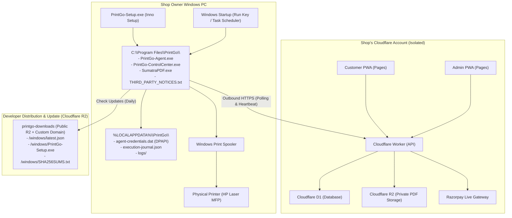

# PrintGo V2 — Commercial Architecture & Productization Plan

## 1. System Vision & Business Context

PrintGo V2 is an online-to-offline print automation platform designed for single physical print shops (xerox centers, campus print kiosks, stationery shops).
The commercial release productizes PrintGo so that:

1. The **shop owner** receives a seamless, non-technical, commercial-grade Windows experience: double-click installer, automatic startup, system tray/GUI control center, zero terminal interaction.
2. The **developer** provisions each shop securely into the shop's dedicated Cloudflare account using automated CLI tooling.
3. The **boundary of control** is the shop's individual Cloudflare deployment (Worker + D1 + R2 + Pages). No multi-tenancy, no central DRM/license servers, no external single-point-of-failure.

---

## 2. Invariants & Guardrails (Preserved)

- **Single Shop Invariant**: 1 Cloudflare Account/Environment = 1 Physical Shop = 1 Active Windows Agent. No `shop_id` tenancy.
- **Zero Paid Cloud Infrastructure**: 100% Cloudflare Free Tier (Worker, D1, R2, Pages).
- **Outbound-Only Agent Security**: Windows Agent NEVER opens inbound listening ports or HTTP servers. All coordination with Cloudflare is via authenticated outbound HTTPS.
- **Credential Protection**: User-specific DPAPI (`CurrentUser` scope) stored in `%LOCALAPPDATA%\PrintGo\agent-credentials.dat`.
- **Retention & Privacy**: Unpaid PDFs deleted after 10m; completed print jobs removed from R2 after 1h; customer PII purged from D1 after 5h.

---

## 3. Component Architecture

---

## 4. Architectural Decisions

### 4.1. Installer: Inno Setup

- **Evaluation**:
  - _Inno Setup_: <3 MB overhead, zero runtime dependencies, scriptable (`PrintGo.iss`), full silent install/update support (`/SILENT`), native Start Menu & Desktop shortcuts, clean uninstall, preserves `%LOCALAPPDATA%` on update/uninstall.
  - _WiX Toolset_: Heavy XML, complex MSI upgrade tables, unnecessary enterprise overhead.
  - _MSIX_: App container isolates registry/DPAPI and restricts child process execution (SumatraPDF, CIM).
- **Decision**: Inno Setup (`PrintGo-Setup.exe`).

### 4.2. Windows Control Center UX: Lightweight Native Desktop UI

- **Constraint**: No Electron (heavy, bloated, 150MB+ runtime). No inbound HTTP server (violates Agent security invariant).
- **Solution**: A lightweight native Windows executable (`PrintGo-ControlCenter.exe`) built using C# WinForms / WPF (.NET Framework 4.8, pre-installed on 100% of modern Windows 10/11 machines) or lightweight script wrapper.
- **Capabilities**:
  - Shows Shop Name, Connection Status, Printer Health (Ready, Offline, Paper Jam, Out of Paper), Last Job Status.
  - Action buttons: "Open Admin Portal", "Check Printer", "Restart Agent", "Diagnostics", "Check for Updates", "Create Support Package".
  - Communicates with `PrintGo-Agent.exe` via process management and reads agent status from `%LOCALAPPDATA%\PrintGo`.

### 4.3. Shop Provisioning Automation

- `pnpm shop:provision`: An interactive, automated CLI script for the developer to provision a shop from scratch (creates D1, runs migrations, creates R2 bucket with CORS, deploys Worker, deploys Customer & Admin Pages, binds secrets).
- `pnpm shop:configure`: CLI script to safely update shop configuration without leaking secrets.
- `pnpm admin:bootstrap`: Creates the initial shop admin account with a secure PBKDF2 hash.

### 4.4. Third-Party Notices & SumatraPDF Compliance

- SumatraPDF is licensed under GNU GPLv3 with certain third-party libraries (MuPDF, unarr).
- For commercial distribution, we package `THIRD_PARTY_NOTICES.txt` including full license text, copyright notices, and instructions on obtaining corresponding source code for GPL-covered binaries.

---

## 5. Implementation Roadmap

1. **Phase 1: Windows Control Center & Support Diagnostics**
   - Build native lightweight Control Center (`PrintGo-ControlCenter`).
   - Implement Support Package generation (sanitized diagnostics zip).
   - Implement Agent pairing wizard / bootstrap flow.
2. **Phase 2: Inno Setup Installer & Windows Packaging**
   - Create `installer/PrintGo.iss`.
   - Setup auto-start via Windows Run key / Task Scheduler.
   - Automated packaging script `scripts/package-installer.mjs`.
3. **Phase 3: Download & Update Pipeline**
   - Define `latest.json` release manifest format and checksum validation.
   - Integrate update-checking into Control Center and Agent.
4. **Phase 4: Developer Shop Provisioning CLI**
   - Implement `scripts/provision-shop.mjs` and `scripts/configure-shop.mjs`.
5. **Phase 5: Admin & Customer PWA Polish**
   - Admin: First-Login Setup Checklist, Printer Health Cards, clear non-technical states.
   - Customer: Privacy Policy / Terms modal, clear retention timeline, mobile polishing.
6. **Phase 6: Documentation & Validation**
   - `docs/NEW_SHOP_INSTALLATION.md`, `docs/OWNER_QUICK_START.md`, `docs/DISASTER_RECOVERY.md`.
   - Full regression suite execution & `docs/COMMERCIAL_RELEASE_READINESS.md`.
