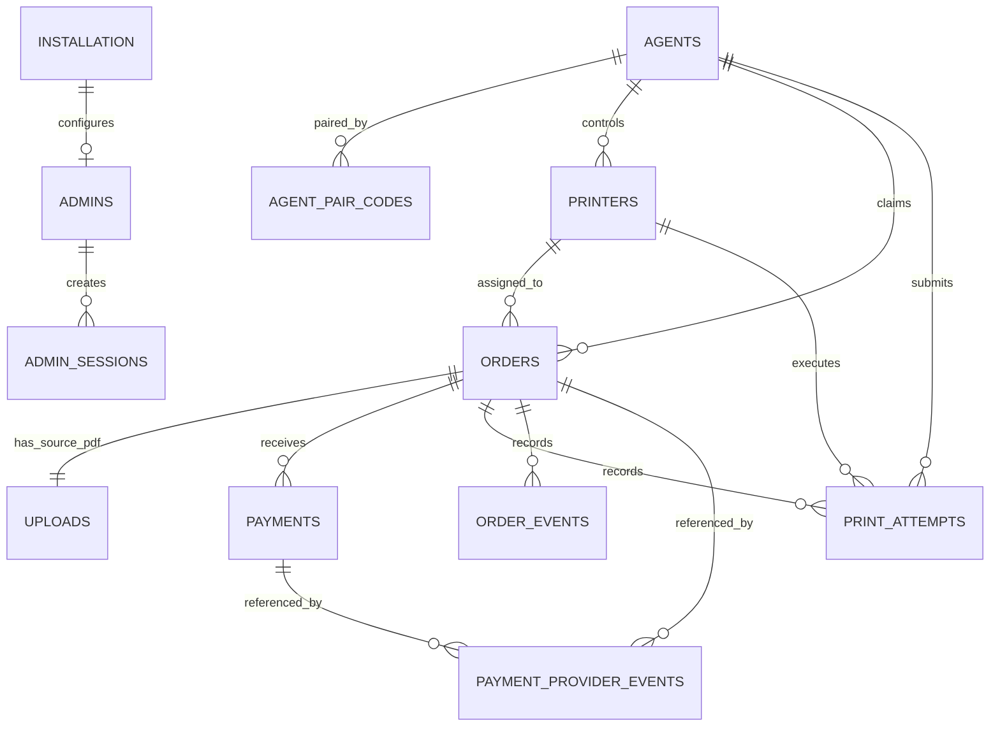

# PrintGo Data Model

**Status:** Phase 1 schema finalized; Phase 2 authentication and Phase 3 configuration behavior documented

**Database:** Cloudflare D1 / SQLite

**Schema source of truth:** `database/migrations/*.sql`

## Customer draft upload additions

Migration `0002_customer_draft_upload.sql` adds the hashed short-lived draft
credential and expiry to `orders`, plus untrusted expected size and a validation
failure code to `uploads`. `uploads.size_bytes` remains the authoritative size
read from R2 and is the only file size used for pricing.

`source_page_count` is browser-derived metadata. It is not a paid-page count;
the Worker derives the chargeable unique count from the explicit normalized
`selected_pages` range.

## Deployment invariant

PrintGo V2 is not multi-tenant.

```text
ONE production deployment
= ONE shop
= ONE domain/site
= ONE Worker
= ONE D1 database
= ONE R2 environment
= ONE shop Razorpay account
```

The private source code is reused for separate shop deployments. Those deployments do not share production customer, order, payment, or PDF data. Consequently, the schema has no tenants collection, runtime tenant selector, or `shop_id` column on every table. Every row inherently belongs to the current installation.

The `installation` table is a fixed one-row profile/configuration record, not a tenant registry. Multiple Agents and printers are allowed inside that one shop installation.

## Core conventions

- Application-generated UUID-compatible `TEXT` values are internal IDs. They are not customer credentials.
- `public_job_code` is a nullable human reference generated after payment and cannot authorize private tracking.
- Only a hash of the future private tracking token is stored.
- All persisted instants are UTC Unix epoch milliseconds in `INTEGER` columns ending in `_at_ms` or `_after_ms`.
- API boundaries later convert timestamps to ISO 8601.
- INR values are non-negative integer paise. Floating-point rupees are never authoritative.
- File sizes are positive integer bytes. The V1 ceiling is 25 MiB (`26,214,400` bytes).
- PDF bytes never enter D1. `uploads` stores private R2 object metadata only.
- SQLite foreign keys and `CHECK`/`UNIQUE` constraints complement application validation.
- Operational/history entities are disabled or revoked instead of deleted. Commercial history uses restrictive foreign keys.

## Relationships



`print_rates`, `file_size_service_charges`, and `audit_logs` are installation-level tables and intentionally have no tenant foreign key.

## Tables

### `installation`

Exactly one row (`id = 1`) holds the current shop's identity and installation-level settings: name/contact information, online-printing switch, maximum PDF bytes, and identification-sheet configuration. The maximum cannot exceed 25 MiB and placement is restricted to `FIRST` or `LAST`.

### `admins`

Record for the single V1 administrator. A constant unique `singleton_key` enforces at most one account. `password_hash` stores the versioned PBKDF2 representation; no seed contains an administrator or plaintext password.

### `admin_sessions`

Stores only SHA-256 hashes of high-entropy opaque session tokens, plus expiry and revocation. Raw session tokens exist only in HttpOnly cookies and do not belong in D1. Expiry and admin-active status are checked server-side. `last_seen_at_ms` is intentionally not written on every request.

### `print_rates`

One explicit rate per `(paper_size, color_mode, sides)` combination. Supported vocabularies are A4/A3, BW/COLOR, and SINGLE/DOUBLE. Rates use integer paise and can be disabled without deleting them.

Phase 3 replaces all eight current combinations in one validated D1 batch. These rows describe current offers only. They are never joined later to recalculate an existing order.

### `file_size_service_charges`

Four unambiguous `(min_bytes_exclusive, max_bytes_inclusive]` bands. The first starts above zero because an uploaded PDF must have a positive byte size. `sort_order` and range pairs are unique.

Phase 3 keeps these boundaries fixed and updates only non-negative integer-paise charges. A band above the installation's current maximum PDF size remains configured for a future limit increase but cannot be selected by the authoritative engine while unreachable.

### `agents`

Allows multiple Windows Agents in one installation. Future credentials are stored only as hashes. An unpaired Agent has no credential hash or paired timestamp and may be disabled without deleting history.

### `agent_pair_codes`

Stores a one-time pairing-code hash, expiry, use time, and paired Agent reference. Raw pairing codes are never persisted.

### `printers`

Allows multiple printers per Agent. Operational status uses a controlled vocabulary. Device-specific capabilities are the one deliberate JSON field because driver capabilities vary; JSON validity is checked by SQLite.

### `orders`

The current commercial and operational source of truth. It stores customer/request snapshots, print selections, immutable pricing amounts, current order status, printer assignment, and claim-lease fields.

The claim tuple (`claimed_by_agent_id`, `claim_id`, `claim_expires_at_ms`) is all-null or all-present. Later claim logic must atomically move `QUEUED` to `CLAIMED`. If the lease expires before safe spool submission, recovery can requeue the order. Lease expiry never by itself proves that a submitted spool job is safe to duplicate.

`printing_amount_paise`, `service_charge_paise`, and `total_amount_paise` are immutable commercial snapshots once an order is priced. Updating `print_rates` or `file_size_service_charges` changes future calculations only; Phase 3 performs no order update or historical recalculation.

### `uploads`

One source-PDF metadata row per order. It stores the private R2 key, trusted byte size, storage lifecycle, retention reason/deadline, and deletion attempts. Logical authorization expiry occurs when `delete_after_ms` passes even if physical deletion has not completed.

### `payments`

Provider-independent payment state tied to the exact order, integer amount, and INR currency. Razorpay order/payment identifiers are unique within the provider namespace. Multiple payment attempts can exist for an order.

### `payment_provider_events`

Minimal webhook idempotency ledger. `(provider, provider_event_id)` is unique, so delivery retries cannot repeat payment actions. Raw webhook bodies are not retained.

### `print_attempts`

Append-oriented history for each submission/retry. `(order_id, attempt_number)` is unique, and `(printer_id, agent_id)` must describe the actual Agent-controlled printer. Windows spool job IDs are indexed with their Agent for reconciliation but are not assumed globally unique forever because Windows may recycle identifiers. `BLOCKED` is distinct from `FAILED`: a blocked spool job may still continue and must not trigger a duplicate submission.

### `order_events`

Append-only operational timeline for status changes and order events. `orders.status` remains current truth; events support admin history and debugging. JSON details must exclude secrets.

### `audit_logs`

Separate security/administrative audit history with actor, action, entity, minimal JSON metadata, and time. It is not the customer-visible order timeline.

Phase 2 records `ADMIN_LOGIN_SUCCESS`, `ADMIN_LOGOUT`, `ADMIN_PASSWORD_CHANGED`, and `ADMIN_SESSIONS_REVOKED` here. Phase 3 records `SHOP_SETTINGS_UPDATED`, `ONLINE_PRINTING_ENABLED`, `ONLINE_PRINTING_DISABLED`, and `PRICING_UPDATED`. Passwords, password hashes, raw session tokens, cookies, and full form payloads are never audit metadata.

## Order state model

The controlled operational states are:

```text
CREATED -> UPLOADING -> UPLOADED -> PAYMENT_PENDING
PAYMENT_PENDING -> PAID -> QUEUED -> CLAIMED -> SPOOLING
SPOOLING -> PRINTING -> PRINTED -> COMPLETED
```

Payment failure/cancellation, cancellation before printing, blocked printing, confirmed failure, safe retry, and admin-recovery paths are defined and tested in `@printgo/domain`.

`FILE_EXPIRED` is intentionally not an order status. Replacing `COMPLETED` with `FILE_EXPIRED` would destroy correct commercial/reporting meaning. A completed order therefore remains `COMPLETED` while its `uploads.storage_status` becomes `EXPIRED`, `DELETE_PENDING`, and finally `DELETED`. The UI can derive “File deleted automatically” without losing the successful order outcome.

## Retention model

| Reason                        |         Duration |
| ----------------------------- | ---------------: |
| `UNPAID`                      |       10 minutes |
| `PAYMENT_FAILED_OR_CANCELLED` |       30 minutes |
| `COMPLETED`                   |         12 hours |
| `UNRESOLVED_PAID_FAILURE`     | maximum 24 hours |

These durations are shared constants in `@printgo/domain`. Later APIs must deny access at the logical deadline even if an R2 deletion retry remains pending.

## Index rationale

| Index                                    | Query supported                                      |
| ---------------------------------------- | ---------------------------------------------------- |
| `orders_status_created_idx`              | Bounded live/failed/status-specific order lists      |
| `orders_created_idx`                     | Recent history and keyset pagination                 |
| `orders_customer_phone_created_idx`      | Admin phone lookup with recent-first results         |
| `orders_claim_recovery_idx`              | Expired `CLAIMED` leases without scanning all orders |
| `uploads_cleanup_idx`                    | Due, non-deleted R2 cleanup candidates               |
| `payments_order_created_idx`             | Payment attempts for one order                       |
| `payments_status_created_idx`            | Payment reconciliation by state/time                 |
| `agents_heartbeat_idx`                   | Active-Agent availability and stale heartbeat checks |
| `agent_pair_codes_expiry_idx`            | Valid unused pair-code cleanup/lookup                |
| `printers_agent_enabled_idx`             | Enabled printers exposed by one Agent                |
| `printers_status_idx`                    | Available/unavailable configured printers            |
| `print_attempts_order_status_idx`        | Attempt history/current attempt for an order         |
| `print_attempts_agent_windows_job_idx`   | Reconcile a spool identifier in its Agent scope      |
| `print_attempts_status_observed_idx`     | Monitoring active/blocked attempts                   |
| `order_events_order_created_idx`         | Stable order timeline pagination                     |
| `payment_provider_events_processing_idx` | Unprocessed/failed webhook reconciliation            |
| `audit_logs_created_idx`                 | Recent audit history                                 |
| `audit_logs_entity_idx`                  | Audit history for one entity                         |

Unique constraints also create lookup indexes for job codes, tracking-token hashes, provider IDs, R2 object keys, session/pair-code hashes, and spool identifiers.

## Future query patterns

Recent history must be bounded and use keyset pagination:

```sql
SELECT *
FROM orders
WHERE (created_at_ms < ? OR (created_at_ms = ? AND id < ?))
ORDER BY created_at_ms DESC, id DESC
LIMIT ?;
```

Active jobs use an indexed status filter, never `SELECT * FROM orders` polling:

```sql
SELECT *
FROM orders
WHERE status IN ('QUEUED', 'CLAIMED', 'SPOOLING', 'PRINTING', 'PRINT_BLOCKED')
ORDER BY created_at_ms ASC
LIMIT ?;
```

Cleanup candidates use the partial cleanup index:

```sql
SELECT id, order_id, r2_object_key
FROM uploads
WHERE storage_status <> 'DELETED'
  AND delete_after_ms <= ?
ORDER BY delete_after_ms ASC
LIMIT ?;
```

The future atomic claim should be one conditional D1 statement/transaction, conceptually:

```sql
UPDATE orders
SET status = 'CLAIMED',
    claimed_by_agent_id = ?,
    claim_id = ?,
    claimed_at_ms = ?,
    claim_expires_at_ms = ?,
    updated_at_ms = ?
WHERE id = ?
  AND status = 'QUEUED'
RETURNING *;
```

Exactly one caller can change a particular queued row. Phase 1 defines only the schema and domain contract; the endpoint and recovery transaction belong to later phases.
