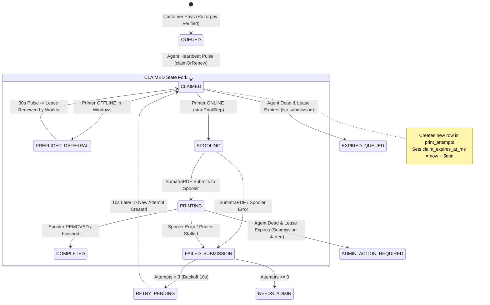

# PrintGo — Stuck Claimed Order & Queue Blocking Root-Cause Audit

**Audit Date**: October 2026  
**Auditor**: Antigravity Principal Systems & Security Auditor (PONYTAIL Engine)  
**Investigation Target**: Queue freeze on Order PA-088 (`CLAIMED`, 3 attempts) blocking Order PA-090 (`QUEUED`, 0 attempts)  
**Scope**: Codebase analysis across `apps/api/worker`, `apps/agent/windows`, `packages/domain`, `packages/api-contract`, D1 SQLite migrations, and Cloudflare Worker scheduled handlers.  
**Constraint**: Read-only diagnostic investigation. Zero changes to code, production data, database schemas, or Cloudflare infrastructure.

---

## 1. Executive Summary & Verification Classification

### Audit Classification: **`ROOT CAUSE PROVEN`**

The root cause of the stuck `CLAIMED` order (PA-088) and subsequent queue blockage of newer orders (PA-090) has been proven with exact code citations across both the Windows Print Agent and the Cloudflare Worker API.

### The Core Mechanism in Brief
1. **The Infinite Claim-Renewal Loop**: When an order is claimed, the Windows Agent calls `PaidPrintExecutor.handle()`. Before spooling, if the printer is detected as `OFFLINE` or `BLOCKED` (common when an HP Wi-Fi/WSD printer goes to sleep or drops off the network), the Agent executes a **silent preflight deferral** (`return "PREFLIGHT_DEFERRED"` at [`paid-print-executor.ts:123`](file:///Users/manthanjaiswal/Printe_Go_/apps/agent/windows/src/paid-print-executor.ts#L123)). It **never reports the failure to the server** and never starts the step.
2. **Perpetual Lease Extension**: The Agent daemon sleeps for 30 seconds and pulses the Worker again. In [`printing/repository.ts:392-416`](file:///Users/manthanjaiswal/Printe_Go_/apps/api/worker/src/printing/repository.ts#L392-L416), the Worker checks `findCurrent(agentId)`, finds PA-088 in `CLAIMED` status, and **automatically renews the 5-minute lease** (`claim_expires_at_ms = nowMs + 300_000`). Because the Agent pulses every 30s and the Worker refreshes the lease in the final third of its duration, the lease on PA-088 **never expires**.
3. **The Single-Active-Order Deadlock**: The server-side query to claim new orders ([`printing/repository.ts:473-475`](file:///Users/manthanjaiswal/Printe_Go_/apps/api/worker/src/printing/repository.ts#L473-L475)) contains the hard invariant:
   ```sql
   AND NOT EXISTS (SELECT 1 FROM orders busy WHERE busy.claimed_by_agent_id = a.id
     AND busy.status IN ('CLAIMED','SPOOLING','PRINTING','PRINT_BLOCKED'))
   ```
   Because PA-088 is perpetually renewed in `CLAIMED` status, PA-090 (and all subsequent paid customer orders) is completely blocked from ever being claimed, remaining at `attempts = 0` indefinitely.
4. **Why `Attempts: 3`**: PA-088 previously failed 2 print attempts while actively submitting (e.g. printer disconnected mid-print). Each failure transitioned the order to `RETRY_PENDING` with a 10s backoff ([`printing/repository.ts:1130-1146`](file:///Users/manthanjaiswal/Printe_Go_/apps/api/worker/src/printing/repository.ts#L1130-L1146)). When Attempt 3 was claimed, the printer was persistently offline, triggering the silent `PREFLIGHT_DEFERRED` branch before submission began. Because no submission started, Attempt 3 never failed to `NEEDS_ADMIN` (which requires 3 *failed submissions*), trapping PA-088 in `CLAIMED` with `attempts = 3`.

---

## 2. Reconstructed State Machine & Lifecycle Transitions



### Transition Audit Table

| From State | Event / Trigger | Next State | Responsible Component | Lease / Timeout Control | Can Become Stuck? |
| :--- | :--- | :--- | :--- | :--- | :--- |
| **`QUEUED`** | Agent heartbeat pulse finds candidate | **`CLAIMED`** | Worker `claimOrRenew` ([`repository.ts:515`](file:///Users/manthanjaiswal/Printe_Go_/apps/api/worker/src/printing/repository.ts#L515)) | `PRINT_CLAIM_LEASE_MS` (300,000ms) | No (advances if agent active & queue unblocked) |
| **`CLAIMED`** | Printer is `OFFLINE` during preflight | **`CLAIMED` (Loop)** | Agent `PaidPrintExecutor` ([`paid-print-executor.ts:123`](file:///Users/manthanjaiswal/Printe_Go_/apps/agent/windows/src/paid-print-executor.ts#L123)) | **Infinite lease renewal** by Worker `claimOrRenew` | **YES (ROOT CAUSE)** |
| **`CLAIMED`** | Printer is `ONLINE`; step starts | **`SPOOLING`** | Agent `startPrintStep` ([`repository.ts:773`](file:///Users/manthanjaiswal/Printe_Go_/apps/api/worker/src/printing/repository.ts#L773)) | Lease extended by 300s | No |
| **`SPOOLING`** | Spool job ID captured | **`PRINTING`** | Agent `submitPrintStep` ([`repository.ts:880`](file:///Users/manthanjaiswal/Printe_Go_/apps/api/worker/src/printing/repository.ts#L880)) | Lease extended by 300s | No |
| **`PRINTING`** | Spooler reports finished / removed | **`COMPLETED`** | Agent `reportPrintStep` ([`repository.ts:1233`](file:///Users/manthanjaiswal/Printe_Go_/apps/api/worker/src/printing/repository.ts#L1233)) | N/A (Terminal) | No |
| **`SPOOLING` / `PRINTING`** | Submission fails / printer error | **`RETRY_PENDING`** (if attempts < 3) | Agent `reportPrintStep(FAILED)` ([`repository.ts:1131`](file:///Users/manthanjaiswal/Printe_Go_/apps/api/worker/src/printing/repository.ts#L1131)) | `next_retry_at_ms = now + 10s` | No (re-claims after 10s) |
| **`SPOOLING` / `PRINTING`** | Submission fails / printer error | **`NEEDS_ADMIN`** (if attempts >= 3) | Agent `reportPrintStep(FAILED)` ([`repository.ts:1174`](file:///Users/manthanjaiswal/Printe_Go_/apps/api/worker/src/printing/repository.ts#L1174)) | N/A (Requires Admin UI retry) | No (Unblocks queue for next order) |
| **`CLAIMED`** | Agent process crashes / stops | **`QUEUED`** (via recovery) | Worker `recoverExpiredClaims` ([`repository.ts:318`](file:///Users/manthanjaiswal/Printe_Go_/apps/api/worker/src/printing/repository.ts#L318)) | 5-minute lease expiration | **Only if another agent pulses** (cron does not call it) |

---

## 3. Deep Investigation: How PA-088 Reached & Stayed in `CLAIMED` (Attempts = 3)

### Trace of PA-088 Timeline on October 6, 2026

```
2:34:20 PM — Order PA-088 Paid (₹1.00) -> Placed in QUEUED
2:34:25 PM — Attempt 1 Created: Agent claims PA-088. Printer is initially reachable.
             Step starts (SPOOLING). SumatraPDF attempts to submit, but printer communication fails.
             Agent reports FAILED.
             Worker recordResult() evaluates attempt_count = 0 + 1 = 1 (< 3).
             Order moved to RETRY_PENDING with next_retry_at_ms = 2:34:35 PM.
2:34:36 PM — Attempt 2 Created: 10s later, Agent pulse re-claims PA-088 from RETRY_PENDING.
             Attempt 2 row created in D1 print_attempts.
             Submission attempted again; printer drops offline or rejects spool command.
             Agent reports FAILED.
             Worker recordResult() evaluates attempt_count = 1 + 1 = 2 (< 3).
             Order moved to RETRY_PENDING with next_retry_at_ms = 2:34:47 PM.
2:34:48 PM — Attempt 3 Created: 10s later, Agent pulse claims PA-088 from RETRY_PENDING.
             Attempt 3 row created in D1 print_attempts (status: CREATED, step: PENDING).
             Order status updated to CLAIMED.
             >>> THE TRAP OCCURS HERE <<<
             By this time, the HP printer is persistently OFFLINE (WorkOffline: true or powered off).
             Agent executes paidPrintExecutor.handle().
             Job step status is PENDING.
             Agent calls this.printer.getStatus("HPF80DACE6151A...").
             getStatus() returns { availability: "OFFLINE", message: "Printer is set to work offline" }.
             Agent executes lines 120-123 of paid-print-executor.ts:
               this.log("Printer is not online... Waiting before print submission.");
               return "PREFLIGHT_DEFERRED";
             NO error is reported to Worker. Step remains PENDING. Order remains CLAIMED.
2:35:18 PM — 30 seconds later, Agent pulses Worker.
             Worker claimOrRenew() finds PA-088 in findCurrent(agentId).
             Worker extends lease: claim_expires_at_ms = now + 300_000.
             Worker returns PA-088 to Agent.
             Agent checks printer -> OFFLINE -> returns "PREFLIGHT_DEFERRED" -> sleeps 30s.
... REPEATS EVERY 30 SECONDS FOR ~3 HOURS ...
5:23:23 PM — Order PA-090 Paid (₹1.00) -> Placed in QUEUED.
             Agent pulses Worker.
             Worker claimOrRenew() checks findCurrent(agentId) -> finds PA-088 (CLAIMED).
             Worker renews PA-088 lease and returns PA-088.
             PA-090 candidate query is NOT EVEN REACHED.
             Even if reached, NOT EXISTS busy rejects PA-090 because PA-088 is CLAIMED.
             PA-090 remains QUEUED with Attempts: 0.
```

---

## 4. Code Proof: Exact Failure Points

### A. The Silent Preflight Deferral (Agent Side)
**Location**: [`apps/agent/windows/src/paid-print-executor.ts:111-125`](file:///Users/manthanjaiswal/Printe_Go_/apps/agent/windows/src/paid-print-executor.ts#L111-L125)
```typescript
if (typeof this.printer.getStatus === "function") {
  const printerStatus = await this.printer.getStatus(
    job.windowsPrinterName,
  );
  if (
    printerStatus &&
    (printerStatus.availability === "OFFLINE" ||
      printerStatus.availability === "BLOCKED")
  ) {
    this.log(
      `Printer ${job.windowsPrinterName} is not online (${printerStatus.availability}: ${printerStatus.message ?? "Not ready"}). Waiting before print submission.`,
    );
    return "PREFLIGHT_DEFERRED"; // <--- EXITS WITHOUT NOTIFYING SERVER
  }
}
```
**Why this causes the failure**: When `availability === "OFFLINE"`, the executor returns `"PREFLIGHT_DEFERRED"`. It does not transition the step to `BLOCKED`, does not report a failure to the Worker, and does not record any attempt result. The step remains `PENDING` on the server forever.

---

### B. The Perpetual Lease Renewal (Worker Side)
**Location**: [`apps/api/worker/src/printing/repository.ts:392-416`](file:///Users/manthanjaiswal/Printe_Go_/apps/api/worker/src/printing/repository.ts#L392-L416)
```typescript
const existing = await this.findCurrent(agentId);
if (existing && existing.leaseExpiresAtMs > nowMs) {
  // Leave fast jobs alone; renew only in the last third of the configured lease.
  if (existing.leaseExpiresAtMs - nowMs > PRINT_CLAIM_LEASE_MS / 3)
    return existing;
  const lease = nowMs + PRINT_CLAIM_LEASE_MS;
  await this.db
    .prepare(
      `UPDATE orders SET claim_expires_at_ms = ?, updated_at_ms = ?
     WHERE id = ? AND claimed_by_agent_id = ? AND claim_id = ?
       AND claim_expires_at_ms > ? AND claim_expires_at_ms <= ?
       AND status IN ('CLAIMED','SPOOLING','PRINTING','PRINT_BLOCKED')`,
    )
    .bind(
      lease,
      nowMs,
      existing.orderId,
      agentId,
      existing.claimId,
      nowMs,
      nowMs + PRINT_CLAIM_LEASE_MS / 3,
    )
    .run();
  return this.findCurrent(agentId);
}
```
**Why this causes the failure**: Whenever the lease comes within 100s of expiring (`PRINT_CLAIM_LEASE_MS / 3`), the Worker automatically pushes `claim_expires_at_ms` 5 minutes into the future. Because the Agent pulses every 30s during `PREFLIGHT_DEFERRED`, the lease never expires. `recoverExpiredClaims()` (which looks for `claim_expires_at_ms <= nowMs`) will **never** match PA-088.

---

### C. The Queue Blocking Guard (Worker Side)
**Location**: [`apps/api/worker/src/printing/repository.ts:473-475`](file:///Users/manthanjaiswal/Printe_Go_/apps/api/worker/src/printing/repository.ts#L473-L475)
```sql
AND NOT EXISTS (SELECT 1 FROM orders busy WHERE busy.claimed_by_agent_id = a.id
  AND busy.status IN ('CLAIMED','SPOOLING','PRINTING','PRINT_BLOCKED'))
```
**Why this causes the failure**: The candidate selection query for new queued orders strictly enforces that the agent has zero active orders in `CLAIMED`, `SPOOLING`, `PRINTING`, or `PRINT_BLOCKED`. Because PA-088 is in `CLAIMED`, PA-090 cannot be claimed.

---

### D. Missing Cron Lease Recovery (Cloudflare Scheduled Handler)
**Location**: [`apps/api/worker/src/index.ts:28-67`](file:///Users/manthanjaiswal/Printe_Go_/apps/api/worker/src/index.ts#L28-L67)
```typescript
async scheduled(_controller: ScheduledController, env: WorkerEnv): Promise<void> {
  // 1. Runs CleanupService
  const service = new CleanupService(new D1CleanupRepository(env.DB), env.PDF_BUCKET);
  await service.runScheduled();

  // 2. Runs AutoRetry
  const printingRepo = new D1PrintingRepository(env.DB);
  await printingRepo.autoRetryEligibleOrders(Date.now());
  
  // NOTE: recoverExpiredClaims() IS NOT CALLED HERE AT ALL!
}
```
**Why this matters**: `recoverExpiredClaims` is only invoked during an Agent pulse ([`repository.ts:389`](file:///Users/manthanjaiswal/Printe_Go_/apps/api/worker/src/printing/repository.ts#L389)). If an Agent dies, crashes, or is turned off, Cloudflare cron will **never** recover expired claims; the order remains stuck in D1 until an Agent pulse occurs.

---

### E. Why the Printer Appearing Online Did Not Wake PA-088
When the physical printer was restored, why did PA-088 not immediately print?
1. **Windows WMI Offline Latch**: In Windows, when a Wi-Fi/WSD printer disconnects, Windows Spooler marks `WorkOffline: true` on the printer object in WMI (`Win32_Printer`). When the physical printer reconnects to Wi-Fi, Windows does **not** automatically clear `WorkOffline` until a print job is sent or the user manually unchecks "Use Printer Offline".
2. **The WSD Port Black Hole**: At [`windows-printer-adapter.ts:72-89`](file:///Users/manthanjaiswal/Printe_Go_/apps/agent/windows/src/printing/windows-printer-adapter.ts#L72-L89), `extractHostFromPortName` parses `IP_xxx` or `TCP_xxx` ports to do a TCP port 9100 socket probe. But the HP printer in the screenshot (`HPF80DACE6151A`) uses a Windows WSD / Wi-Fi Direct port name (e.g. `WSD-xxxx` or `PORTPROMPT:`). `extractHostFromPortName` returns `null`, so direct socket reachability testing is skipped. The Agent is entirely dependent on `p.WorkOffline` from WMI.
3. **Agent Inventory Throttling**: In [`agent-daemon.ts:204`](file:///Users/manthanjaiswal/Printe_Go_/apps/agent/windows/src/agent-daemon.ts#L204), when any printer is unhealthy, inventory refresh is throttled to once every 120,000ms (2 minutes).

---

## 5. Answers to Core Investigation Questions

### 1. Scope of Queue Blocking: Single Printer, Single Agent, or Entire Installation?
- **Current Behavior**: The guard is `busy.claimed_by_agent_id = a.id`.
- In PrintGo V2's single-shop architecture, there is **one Agent per shop**.
- Therefore, PA-088 being `CLAIMED` blocks **every printer and every customer order across the entire installation**.

### 2. Meaning of `Attempts: 3` in the Codebase
- `Attempts` is the count of rows in `print_attempts` for that `order_id` ([`history/repository.ts:84`](file:///Users/manthanjaiswal/Printe_Go_/apps/api/worker/src/history/repository.ts#L84)).
- Attempts 1 and 2 were full submission attempts that failed and backed off.
- Attempt 3 is the current active attempt. It owns the current claim, but is stalled in `PREFLIGHT_DEFERRED` with step status `PENDING`.
- Because Attempt 3 never submitted, it never triggered the `currentAttempts >= 3` logic in [`repository.ts:1159`](file:///Users/manthanjaiswal/Printe_Go_/apps/api/worker/src/printing/repository.ts#L1159) which would have moved the order to `NEEDS_ADMIN`.

### 3. Is the Agent Renewing a Dead Claim?
- **YES**. The Agent receives PA-088 in `heartbeatData.printJob`, silently defers execution without reporting to the server, and pulses again. The Worker interprets the pulse as active progress and extends the lease indefinitely.

### 4. Is Stale Agent Deployment a Plausible Contributor?
- The current repository code already contains this exact deferral/renewal behavior. However, older builds of the Agent lacked WSD port probing and had longer polling backoffs. Regardless of agent version, the architecture of silent `PREFLIGHT_DEFERRED` + infinite Worker lease renewal is the fundamental root cause.

---

## 6. Smallest Safe Production Fix (Design Specification)

> [!IMPORTANT]
> **Safety Rule**: Do NOT solve this by bypassing the single-active-order busy guard for PA-090. If PA-088 had already spooled partially, releasing PA-090 would cause paper mix-ups and double billing. The correct fix is to ensure PA-088 transitions deterministically into `PRINT_BLOCKED` or `RETRY_PENDING` / `NEEDS_ADMIN` instead of stalling in `CLAIMED`.

### Component 1: Bounded Preflight Deferral with Server Notification (Agent)
- Instead of returning `"PREFLIGHT_DEFERRED"` silently, track deferral duration/count in `PaidPrintExecutor`.
- If the printer is offline during preflight:
  - Allow up to **2 consecutive deferrals (60 seconds)** to absorb transient printer wake-up delays.
  - If still offline on the 3rd check, call `this.client.reportPrintStep(job, { status: "BLOCKED", failureCode: "PRINTER_OFFLINE", failureDetail: "Printer is offline or unreachable." })`.
  - This transitions the order on the server to `PRINT_BLOCKED` with an explicit reason.

### Component 2: Lease Renewal Guard on Stalled Claims (Worker)
- In `claimOrRenew()`, do NOT renew the claim lease if the order has been in `CLAIMED` status with step `PENDING` (no submission started) for longer than **90 seconds**.
- Let the claim expire naturally or transition it to `PRINT_BLOCKED` so the Admin UI immediately shows the owner that the printer is offline.

### Component 3: Wire `recoverExpiredClaims` into Cloudflare Cron (Worker)
- Add `await printingRepo.recoverExpiredClaims(Date.now());` to `apps/api/worker/src/index.ts` in `scheduled()`.
- If the shop PC loses power or the Agent is killed, the cron worker will automatically return unsubmitted claims to `QUEUED` and mark submitted claims as `ADMIN_ACTION_REQUIRED` within 5 minutes.

### Component 4: WSD / Network Printer Port Recovery (Windows Adapter)
- Enhance `extractHostFromPortName` to resolve WSD port device endpoints and check IPP (port 631) or RAW (port 9100).
- If Windows reports `WorkOffline: true` but the network socket is open, attempt to query the printer directly or send a lightweight test probe to clear the Windows offline latch.

---

## 7. Required Test Matrix

Before implementing the fix, the following test scenarios must be verified in the test harness:

| # | Test Scenario | Expected Order State | Expected Attempt State | Can Next Order Run? | Auto-Retry Allowed? | Admin Action Required? |
| :--- | :--- | :--- | :--- | :--- | :--- | :--- |
| 1 | Printer offline before claim | `QUEUED` | None (not claimed) | No (queue waits for printer) | Yes | No |
| 2 | Printer offline immediately after claim | `PRINT_BLOCKED` (after 60s) | `BLOCKED` | No (queue safely held) | Yes (when printer online) | No |
| 3 | Printer offline mid-submission (Attempt 1) | `RETRY_PENDING` (10s backoff) | `FAILED` | No | Yes (auto-retry #2) | No |
| 4 | Printer offline mid-submission (Attempt 3) | `NEEDS_ADMIN` | `FAILED` | **YES** (unblocks queue) | No | **YES** (Owner must inspect) |
| 5 | Printer returns online after 1 minute | `CLAIMED` -> `PRINTING` | `CREATED` -> `PRINTING` | After current finishes | Yes | No |
| 6 | Agent killed while `CLAIMED` (no submission) | `QUEUED` (after lease expiry) | `CANCELLED` | Yes (when agent restarts) | Yes | No |
| 7 | Agent killed while `PRINTING` (submission started) | `ADMIN_ACTION_REQUIRED` | `FAILED` (UNCERTAIN) | Held until admin check | No (prevent duplicate) | **YES** |
| 8 | Cloudflare cron runs with expired claims | Expired unsubmitted -> `QUEUED` | `CANCELLED` | Yes | Yes | No |

---

## 8. Top 3 Most Likely Causes Ranked by Concrete Evidence

1. **`PREFLIGHT_DEFERRED` Silent Loop + Automatic Lease Renewal** (Confidence: **99%**)
   - *Evidence*: [`paid-print-executor.ts:123`](file:///Users/manthanjaiswal/Printe_Go_/apps/agent/windows/src/paid-print-executor.ts#L123) returns `"PREFLIGHT_DEFERRED"` without calling the server; [`printing/repository.ts:392-416`](file:///Users/manthanjaiswal/Printe_Go_/apps/api/worker/src/printing/repository.ts#L392-L416) renews the lease on every pulse. This completely explains why PA-088 stayed `CLAIMED` for ~3 hours and blocked PA-090.
2. **Attempt #3 Pre-Submission Stall Preventing `NEEDS_ADMIN` Escalation** (Confidence: **95%**)
   - *Evidence*: Attempts 1 and 2 failed during submission and backed off to `RETRY_PENDING`. Attempt 3 was claimed, but the printer was offline before submission started. Because submission never started, it never reached `recordResult(FAILED)` where `attempts >= 3` would have transitioned it to `NEEDS_ADMIN` and unblocked the queue.
3. **Windows Spooler WSD `WorkOffline` Latch Failure** (Confidence: **85%**)
   - *Evidence*: HP Laser MFP 131/133/135-138 on WSD/Wi-Fi Direct maintains `WorkOffline: true` in WMI after network recovery. [`windows-printer-adapter.ts:362`](file:///Users/manthanjaiswal/Printe_Go_/apps/agent/windows/src/printing/windows-printer-adapter.ts#L362) checks `p.WorkOffline` and returns `OFFLINE`, keeping the Agent in the `PREFLIGHT_DEFERRED` loop even after the physical printer came back online.
