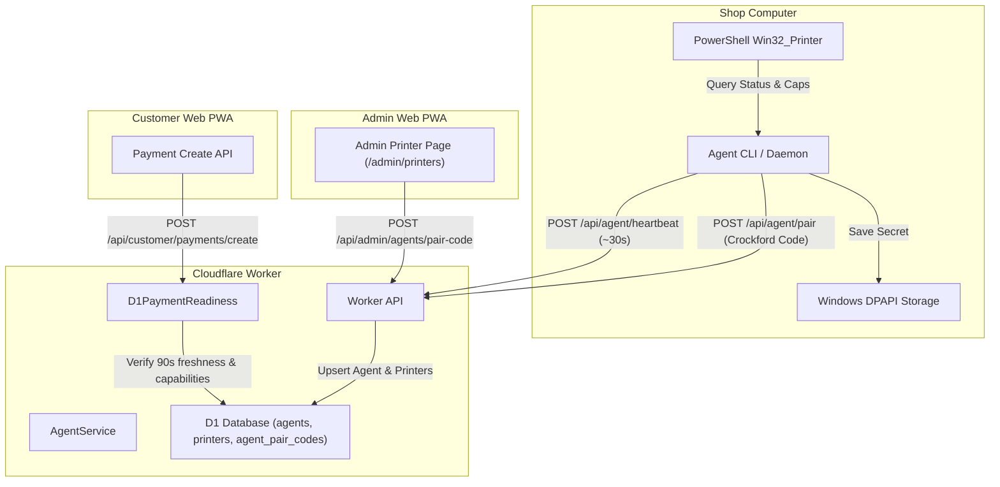

# Windows Agent Pairing, Heartbeats & Printer Readiness

The PrintGo Windows Agent (`apps/agent/windows`) connects the physical print shop computer and connected printers to the Cloudflare Worker API. It establishes persistent agent identity, securely stores credentials, discovers local printers, periodically reports status and capabilities, executes test print commands via the Windows print spooler, and feeds the cloud payment readiness gate.

Phase 10 adds paid-order leasing, short-lived private R2 download, local PDF
validation, persisted print-plan execution, and restart reconciliation. See
[END_TO_END_PRINTING.md](./END_TO_END_PRINTING.md), [PRINTER_TESTING.md](./PRINTER_TESTING.md),
and [IDENTIFICATION_SHEET.md](./IDENTIFICATION_SHEET.md).

---

## 1. Architecture Overview



---

## 2. Agent Pairing Protocol

Agent pairing allows a shop computer running the Windows Agent to establish a trusted, persistent identity with the Cloudflare Worker without exposing long-lived master credentials or secrets in URL strings.

### Step 1: Pair Code Generation (Admin)

1. An authenticated shop administrator navigates to `/admin/printers` and clicks **Pair New Agent**.
2. The browser requests `POST /api/admin/agents/pair-code`.
3. The server generates an 8-character Crockford Base32 pair code (e.g., `H8X2-9K4M`, excluding confusing characters `I`, `L`, `O`, `U`).
4. The server computes the SHA-256 hash of the normalized code and stores it in the `agent_pair_codes` table with an expiration of **10 minutes** (`AGENT_PAIR_CODE_LIFETIME_MS = 600_000`).
5. The raw pair code is displayed to the admin once with a copy-to-clipboard helper.

### Step 2: Agent Pairing Exchange

1. The shop operator runs the agent on the Windows computer:
   ```bash
   printgo-agent --pair H8X2-9K4M --server https://api.yourshop.com --name "Front Desk PC"
   ```
2. The agent issues `POST /api/agent/pair`:
   ```json
   {
     "pairCode": "H8X2-9K4M",
     "displayName": "Front Desk PC"
   }
   ```
3. The Worker normalizes the pair code (removing spaces/dashes, converting to uppercase, mapping `O` to `0` and `I`/`L` to `1`) and computes the SHA-256 hash.
4. The database validates that the code exists, is not expired, and has not already been used.
5. The Worker generates a unique `agentId` (UUID) and a cryptographically secure 32-byte Base64URL `agentSecret`.
6. The Worker stores the SHA-256 hash of the `agentSecret` in `agents.credential_hash`, marks the pair code consumed atomically with `used_at = nowMs` and `paired_agent_id = agentId`, and returns:
   ```json
   {
     "ok": true,
     "data": {
       "agentId": "agent_uuid...",
       "agentSecret": "base64url_secret...",
       "displayName": "Front Desk PC"
     }
   }
   ```
7. The plaintext `agentSecret` is never stored in the database.

Pairing does not count as a heartbeat. A newly paired Agent remains offline for
readiness purposes until its first authenticated heartbeat succeeds.

The Agent accepts HTTPS origins only. Plain HTTP is permitted solely for
`localhost`, `127.0.0.1`, or `[::1]` development. Server URLs containing user
credentials, query parameters, fragments, or paths are rejected before a pair
code or Agent secret is sent. Pair codes and Agent secrets are never written to
Agent status logs.

---

## 3. Credential Storage

The Agent must store its credentials (`agentId`, `agentSecret`, `serverUrl`, `displayName`) locally so that it can resume heartbeats automatically after machine reboots without re-pairing.

- **Windows Production (`WindowsDpapiCredentialStore`)**:
  - Encrypts credentials using Windows Data Protection API (DPAPI) via PowerShell:
    ```powershell
    [System.Security.Cryptography.ProtectedData]::Protect(
      $bytes, $entropy, [System.Security.Cryptography.DataProtectionScope]::CurrentUser
    )
    ```
  - The ciphertext is tied directly to the Windows user account and saved to:
    `%LOCALAPPDATA%\PrintGo\agent-credentials.dat`
  - No plaintext credentials exist on disk.
- **Non-Windows / Development Fallback (`DevelopmentCredentialStore`)**:
  - On non-Windows development platforms, credentials fall back to a local JSON file at `~/.printgo/agent-credentials.local.json` with file mode `0600`. This plaintext development fallback is forbidden in production.

---

## 4. Heartbeat Loop & Printer Discovery

Once paired, the `AgentDaemon` maintains a background pulse:

1. **Heartbeat Frequency**:
   - Pulses immediately upon startup.
   - Pulses every **30 seconds** (`AGENT_HEARTBEAT_INTERVAL_MS = 30_000`).
   - Server timeout window is **90 seconds** (`AGENT_HEARTBEAT_TIMEOUT_MS = 90_000`), allowing up to two missed pulses before the agent is considered offline.
2. **Local Printer Discovery**:
   - Queries local printers using PowerShell against the `Win32_Printer` WMI class.
   - Normalizes printer status:
     - `WorkOffline == true` or `PrinterStatus == 7` -> `OFFLINE`
     - `DetectedErrorState` (paper jam, door open, out of paper) -> `BLOCKED`
     - `PrinterStatus == 3` (idle/ready) -> `ONLINE`
     - All other states -> `UNKNOWN`
   - Normalizes capabilities:
     - Parses `CapabilityDescriptions` for color capability (`colour: boolean`), duplex support (`duplex: boolean`), and supported standard paper sizes (`paperSizes: ["A4", "A3", ...]`).
3. **Heartbeat Payload**:
   ```http
   POST /api/agent/heartbeat HTTP/1.1
   Host: api.yourshop.com
   Authorization: Bearer <agentSecret>
   X-PrintGo-Agent-Id: <agentId>
   Content-Type: application/json

   {
     "agentVersion": "2.0.0",
     "operationalState": "ONLINE",
     "printers": [
       {
         "windowsPrinterName": "Canon MF4700 Series",
         "displayName": "Front Desk Canon",
         "isDefault": true,
         "status": "ONLINE",
         "statusReason": null,
         "capabilities": {
           "colour": false,
           "duplex": true,
           "paperSizes": ["A4"]
         }
       }
     ]
   }
   ```
4. **Server Processing**:
   - Verifies the SHA-256 hash of the bearer token against `agents.credential_hash`.
   - Rejects revoked or inactive agents with 401 `AGENT_UNAUTHORIZED`.
   - Updates `agents.last_heartbeat_at`.
   - Upserts discovered printers into `printers`, preserving admin toggles (`enabled`).
   - Marks a previously known printer `OFFLINE` when it is absent from the latest successful Agent report, and refreshes `last_status_at_ms` for every reported printer.
   - Responds with `{ ok: true, data: { acknowledged: true, serverTimeMs: 1234567890 } }`.
5. **Revocation & Auto-Stop**:
   - If the Worker responds with 401 `AGENT_UNAUTHORIZED`, the `AgentDaemon` immediately terminates its heartbeat timer and shuts down cleanly to avoid log spamming.

---

## 5. Real Printer-Readiness Gate for Payments

Prior to Phase 7, payment creation in production was intentionally hard-coded to fail closed. In Phase 7, `D1PaymentReadiness` implements the full multi-point readiness check:

When a customer submits `POST /api/customer/payments/create`, the server validates:

1. **Shop Online Printing Setting**: `installation.online_printing_enabled === 1`. If disabled, returns `ONLINE_PRINTING_DISABLED`.
2. **Online Agent Heartbeat**: At least one active agent has sent a heartbeat within the last 90 seconds (`nowMs - last_heartbeat_at <= 90_000`). If none, returns `AGENT_OFFLINE`.
3. **Online Enabled Printer**: At least one printer belonging to an active online agent is marked `enabled === 1` and has status `ONLINE` or `UNKNOWN`. If none is configured, returns `NO_CONFIGURED_PRINTER`; unavailable states return `PRINTER_UNAVAILABLE`.
4. **Print Capability Matching**: The enabled online printer must satisfy the customer's print options:
   - If `colorMode === "COLOR"`, printer must have `colour === true`.
   - If `sides === "DOUBLE"`, printer must have `duplex === true`.
   - The requested `paperSize` (e.g. `A4`) must be included in `paperSizes`.
   - A mismatch returns `PAPER_SIZE_UNSUPPORTED`, `COLOR_MODE_UNSUPPORTED`, `SIDES_MODE_UNSUPPORTED`, or `PRINTER_UNAVAILABLE`.

### Development Bypass

In local development environments only (`APP_ENV === "development"`), setting `PAYMENT_READINESS_DEV_BYPASS="true"` in `.dev.vars` permits testing payment creation without a live agent running. In production (`APP_ENV === "production"`), the check is strictly enforced and cannot be bypassed.

---

## 6. Admin Printer Management UI

The Admin PWA at `/admin/printers` provides operational controls:

- **Pair Code Modal**: Generate single-use pairing codes with real-time expiration countdown and copy button.
- **Agent Status**: List of registered shop agents with connection status (`Online` vs `Offline` based on 90s freshness), paired date, and last heartbeat timestamp.
- **Revocation**: Admins can revoke an agent. Revocation marks `is_active = 0` and writes an audit log entry. Revoked agents are instantly rejected by the Worker.
- **Printer Controls**: List of discovered printers with capabilities badges (Color, B&W, Duplex, Paper sizes) and an enable/disable toggle. Disabled printers are immediately excluded from payment readiness calculations.

---

## 7. Printer Adapter & Spool Monitoring (Phase 8)

The Windows Agent integrates with the Windows Print Spooler subsystem via PowerShell and CIM/WMI:

- **`PrinterAdapter` Interface**:
  - `submitPdfJob(printerName, pdfPath, settings)`: Deterministic headless print engine via SumatraPDF CLI (`-print-to "<printer>" -print-settings "<copies>x,paper=<paperSize>,<color>,<duplex>,<pageRange>,fit" -silent "<pdf>"`), with fail-closed capability validation preventing silent downgrades, and strict document title spooler correlation.
  - `getJobStatus(printerName, spoolJobId)`: Queries `Win32_PrintJob` and maps status bits into `QUEUED`, `PRINTING`, `BLOCKED`, `COMPLETED_OR_REMOVED`, or `FAILED`.
  - `cancelJob(printerName, spoolJobId)`: Cancels a print job in the spooler queue.
- **Diagnostic PDF Generation**:
  - Pure TypeScript raw single-page A4 generator creates a clean diagnostic page with timestamp, agent name, printer name, and command ID.
  - Customer PDFs from R2 are strictly not printed or downloaded in Phase 8.
- **Identification Sheet Generation (Phase 9)**:
  - Generates one local A4, black-and-white, single-sided sheet with a public job code, masked phone, customer print summary, frozen amount, and bounded instructions.
  - Uses the same exact named printer with one copy and page range `1`; it never inherits customer copies, colour, paper size, or duplex settings.
  - Deletes the temporary PDF after successful or failed submission and never uploads it to D1 or R2.
  - Does not claim orders, download customer PDFs, or execute customer-document printing.
- **`BLOCKED != FAILED` Rule**:
  - Recoverable conditions (`PAPER_OUT`, `PAPER_JAM`, `OFFLINE`, `DOOR_OPEN`, `USER_INTERVENTION`) are reported as `BLOCKED`.
  - The job is **NEVER automatically resubmitted**, preventing duplicate printing once paper is loaded.
  - See [PRINTER_TESTING.md](./PRINTER_TESTING.md) for full details.
- **Paid jobs (Phase 10)**:
  - Heartbeat returns at most the live claim owned by that authenticated Agent.
  - A restricted local journal prevents restart from blindly submitting again.
  - Customer PDFs use unpredictable temporary paths and exact paid settings.
  - Ambiguous submission/correlation becomes `ADMIN_ACTION_REQUIRED`; no Phase 10 retry occurs.

---

## 8. Manual Testing & Verification

### Running the Windows Agent Locally (Development Mode)

```bash
# From repository root
pnpm --filter @printgo/windows-agent dev -- --pair <PAIR_CODE> --server http://localhost:8787 --name "Local Dev PC"
```

### CLI Arguments

- `--pair <CODE>`: Pair using the given Crockford code.
- `--server <URL>`: Set API server URL (default: `http://localhost:8787`).
- `--name <NAME>`: Human-readable display name for this computer.
- `--clear`: Clear locally stored credentials and exit.

> [!NOTE]
> On macOS and Linux development hosts, `DevelopmentPrinterAdapter` and `DevelopmentCredentialStore` are used automatically. Real Windows printer discovery, DPAPI encryption, and spooler test printing require a Windows host and were not exercised on non-Windows test environments.
